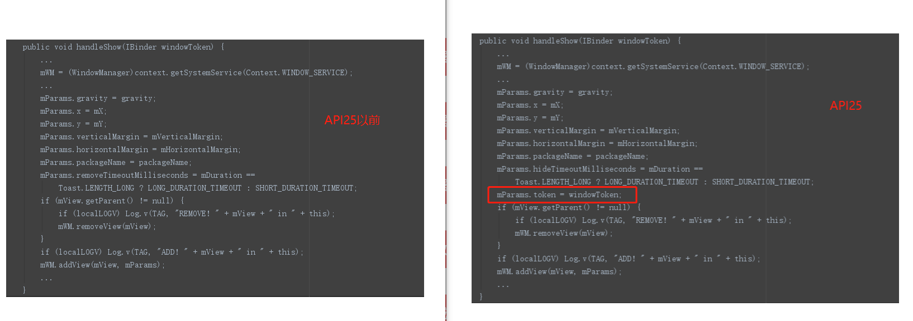

# DToast

先看看使用系统Toast存在的问题：

    1.当通知权限被关闭时在华为等手机上Toast不显示；

    2.Toast的队列机制在不同手机上可能会不相同；

    3.Toast的BadTokenException问题；

当发现系统Toast存在问题时，不少同学都会采用自定义的TYPE_TOAST弹窗来实现相同效果。虽然大部分情况下效果都是
OK的，但其实TYPE_TOAST弹窗依然存在兼容问题：

    4.Android8.0之后的token null is not valid问题(实测部分机型问题)；

    5.Android7.1之后，不允许同时展示两个TYPE_TOAST弹窗(实测部分机型问题)。

那么，DToast使用的解决方案是：

    1.通知权限未被关闭时，使用SystemToast(修复了问题2和问题3的系统Toast);
    2.通知权限被关闭时，使用DovaToast(自定义的TYPE_TOAST弹窗);
    3.当使用DovaToast出现token null is not valid时，尝试使用ActivityToast(自定义的TYPE_APPLICATION_ATTACHED_DIALOG弹窗
    ，只有当传入Context为Activity时，才会启用ActivityToast).

    相信不少同学旧项目中封装的ToastUtil都是直接使用的ApplicationContext作为上下文，然后在需要弹窗的时候直接就是ToastUtil.show(str)，这样的使用方式对于我们来说是最方便的啦。
    当然，使用DToast你也依然可以沿用这种封装方式，但这种方式在下面这个场景中可能会无法成功展示出弹窗(该场景下原生Toast也一样无法弹出)，不过请放心不会导致应用崩溃，而且这个场景出现的概率较小，有以下三个必要条件：1.通知栏权限被关闭(通知栏权限默认都是打开的) 2.非MIUI手机 3.Android8.0以上的部分手机(我最近测试中的几部8.0+设备都不存在该问题)。
    不过，如果想要保证在所有场景下都能正常展示弹窗，还是建议在DToast.make(context)时传入Activity作为上下文，这样在该场景下DToast会启用ActivityToast展示出弹窗。

## 问题一：关闭通知权限时Toast不显示

    看下方Toast源码中的show()方法，通过AIDL获取到INotificationManager，并将接下来的显示流程控制权
    交给NotificationManagerService。
    NMS中会对Toast进行权限校验，当通知权限校验不通过时，Toast将不做展示。
    当然不同ROM中NMS可能会有不同，比如MIUI就对这部分内容进行了修改，所以小米手机关闭通知权限不会导致Toast不显示。

      /**
         * Show the view for the specified duration.
         */
        public void show() {
            if (mNextView == null) {
                throw new RuntimeException("setView must have been called");
            }

            INotificationManager service = getService();
            String pkg = mContext.getOpPackageName();
            TN tn = mTN;
            tn.mNextView = mNextView;

            try {
                service.enqueueToast(pkg, tn, mDuration);
            } catch (RemoteException e) {
                // Empty
            }
        }

如何解决这个问题？只要能够绕过NotificationManagerService即可。

    DovaToast通过使用TYPE_TOAST实现全局弹窗功能，不使用系统Toast,也没有使用NMS服务，因此不受通知权限限制。

## 问题二：系统Toast的队列机制在不同手机上可能会不相同

     我找了四台设备，创建两个Gravity不同的Toast并调用show()方法,结果出现了四种展示效果：

            * 荣耀5C-android7.0（只看到展示第一个Toast）
            * 小米8-MIUI10（只看到展示第二个Toast，即新的Toast.show会中止当前Toast的展示）
            * 红米6pro-MIUI9（两个Toast同时展示）
            * 荣耀5C-android6.0（第一个TOAST展示完成后，第二个才开始展示）

造成这个问题的原因应该是各大厂商ROM中NMS维护Toast队列的逻辑有差异。
同样的，DToast内部也维护着自己的队列逻辑，保证在所有手机上使用DToast的效果相同。

     DToast中多个弹窗连续出现时：

            1.相同优先级时，会终止上一个，直接展示后一个；
            2.不同优先级时，如果后一个的优先级更高则会终止上一个，直接展示后一个。

## 问题三：系统Toast的BadTokenException问题

* Toast有个内部类 TN（extends ITransientNotification.Stub），调用Toast.show()时会将TN传递给NMS；

        public void show() {
            if (mNextView == null) {
                throw new RuntimeException("setView must have been called");
            }
            INotificationManager service = getService();
            String pkg = mContext.getOpPackageName();
            TN tn = mTN;
            tn.mNextView = mNextView;
            try {
                service.enqueueToast(pkg, tn, mDuration);
            } catch (RemoteException e) {
                // Empty
            }
        }

* 在NMS中会生成一个windowToken，并将windowToken给到WindowManagerService，WMS会暂时保存该token并用于之后的校验；

    NotificationManagerService.java  #enqueueToast源码：

            synchronized (mToastQueue) {
                int callingPid = Binder.getCallingPid();
                long callingId = Binder.clearCallingIdentity();
                try {
                    ToastRecord record;
                    int index = indexOfToastLocked(pkg, callback);
                    // If it's already in the queue, we update it in place, we don't
                    // move it to the end of the queue.
                    if (index >= 0) {
                        record = mToastQueue.get(index);
                        record.update(duration);
                    } else {
                        // Limit the number of toasts that any given package except the android
                        // package can enqueue.  Prevents DOS attacks and deals with leaks.
                        if (!isSystemToast) {
                            int count = 0;
                            final int N = mToastQueue.size();
                            for (int i=0; i<N; i++) {
                                 final ToastRecord r = mToastQueue.get(i);
                                 if (r.pkg.equals(pkg)) {
                                     count++;
                                     if (count >= MAX_PACKAGE_NOTIFICATIONS) {
                                         Slog.e(TAG, "Package has already posted " + count
                                                + " toasts. Not showing more. Package=" + pkg);
                                         return;
                                     }
                                 }
                            }
                        }

                        Binder token = new Binder();//生成一个token
                        mWindowManagerInternal.addWindowToken(token, TYPE_TOAST, DEFAULT_DISPLAY);
                        record = new ToastRecord(callingPid, pkg, callback, duration, token);
                        mToastQueue.add(record);
                        index = mToastQueue.size() - 1;
                        keepProcessAliveIfNeededLocked(callingPid);
                    }
                    // If it's at index 0, it's the current toast.  It doesn't matter if it's
                    // new or just been updated.  Call back and tell it to show itself.
                    // If the callback fails, this will remove it from the list, so don't
                    // assume that it's valid after this.
                    if (index == 0) {
                        showNextToastLocked();
                    }
                } finally {
                    Binder.restoreCallingIdentity(callingId);
                }
            }

* 然后NMS通过调用TN.show(windowToken)回传token给TN；

            /**
             * schedule handleShow into the right thread
             */
            @Override
            public void show(IBinder windowToken) {
                if (localLOGV) Log.v(TAG, "SHOW: " + this);
                mHandler.obtainMessage(SHOW, windowToken).sendToTarget();
            }

* TN使用该token尝试向WindowManager中添加Toast视图(mParams.token = windowToken)；

    在API25的源码中，Toast的WindowManager.LayoutParams参数新增了一个token属性，用于对添加的窗口进行校验。

* 当param.token为空时，WindowManagerImpl会为其设置 DefaultToken；

        @Override
        public void addView(@NonNull View view, @NonNull ViewGroup.LayoutParams params) {
            applyDefaultToken(params);
            mGlobal.addView(view, params, mContext.getDisplay(), mParentWindow);
        }

        private void applyDefaultToken(@NonNull ViewGroup.LayoutParams params) {
            // Only use the default token if we don't have a parent window.
            if (mDefaultToken != null && mParentWindow == null) {
                if (!(params instanceof WindowManager.LayoutParams)) {
                    throw new IllegalArgumentException("Params must be WindowManager.LayoutParams");
                }
                // Only use the default token if we don't already have a token.
                final WindowManager.LayoutParams wparams = (WindowManager.LayoutParams) params;
                if (wparams.token == null) {
                    wparams.token = mDefaultToken;
                }
            }
        }

* 当WindowManager收到addView请求后会检查 mParams.token 是否有效，若有效则添加窗口展示，否则抛出BadTokenException异常.

                  switch (res) {
                      case WindowManagerGlobal.ADD_BAD_APP_TOKEN:
                      case WindowManagerGlobal.ADD_BAD_SUBWINDOW_TOKEN:
                          throw new WindowManager.BadTokenException(
                                  "Unable to add window -- token " + attrs.token
                                  + " is not valid; is your activity running?");
                      case WindowManagerGlobal.ADD_NOT_APP_TOKEN:
                          throw new WindowManager.BadTokenException(
                                  "Unable to add window -- token " + attrs.token
                                  + " is not for an application");
                      case WindowManagerGlobal.ADD_APP_EXITING:
                          throw new WindowManager.BadTokenException(
                                  "Unable to add window -- app for token " + attrs.token
                                  + " is exiting");
                      case WindowManagerGlobal.ADD_DUPLICATE_ADD:
                          throw new WindowManager.BadTokenException(
                                  "Unable to add window -- window " + mWindow
                                  + " has already been added");
                      case WindowManagerGlobal.ADD_STARTING_NOT_NEEDED:
                          // Silently ignore -- we would have just removed it
                          // right away, anyway.
                          return;
                      case WindowManagerGlobal.ADD_MULTIPLE_SINGLETON:
                          throw new WindowManager.BadTokenException("Unable to add window "
                                  + mWindow + " -- another window of type "
                                  + mWindowAttributes.type + " already exists");
                      case WindowManagerGlobal.ADD_PERMISSION_DENIED:
                          throw new WindowManager.BadTokenException("Unable to add window "
                                  + mWindow + " -- permission denied for window type "
                                  + mWindowAttributes.type);
                      case WindowManagerGlobal.ADD_INVALID_DISPLAY:
                          throw new WindowManager.InvalidDisplayException("Unable to add window "
                                  + mWindow + " -- the specified display can not be found");
                      case WindowManagerGlobal.ADD_INVALID_TYPE:
                          throw new WindowManager.InvalidDisplayException("Unable to add window "
                                  + mWindow + " -- the specified window type "
                                  + mWindowAttributes.type + " is not valid");
                  }

什么情况下windowToken会失效？

    UI线程发生阻塞，导致TN.show()没有及时执行，当NotificationManager的检测超时后便会删除WMS中的该token，即造成token失效。

如何解决？

    Google在API26中修复了这个问题，即增加了try-catch:

                // Since the notification manager service cancels the token right
                // after it notifies us to cancel the toast there is an inherent
                // race and we may attempt to add a window after the token has been
                // invalidated. Let us hedge against that.
                try {
                    mWM.addView(mView, mParams);
                    trySendAccessibilityEvent();
                } catch (WindowManager.BadTokenException e) {
                    /* ignore */
                }

因此对于8.0之前的我们也需要做相同的处理。DToast是通过反射完成这个动作，具体看下方实现：

      //捕获8.0之前Toast的BadTokenException，Google在Android 8.0的代码提交中修复了这个问题
         private void hook(Toast toast) {
             try {
                 Field sField_TN = Toast.class.getDeclaredField("mTN");
                 sField_TN.setAccessible(true);
                 Field sField_TN_Handler = sField_TN.getType().getDeclaredField("mHandler");
                 sField_TN_Handler.setAccessible(true);

                 Object tn = sField_TN.get(toast);
                 Handler preHandler = (Handler) sField_TN_Handler.get(tn);
                 sField_TN_Handler.set(tn, new SafelyHandlerWrapper(preHandler));
             } catch (Exception e) {
                 e.printStackTrace();
             }
         }

         public class SafelyHandlerWrapper extends Handler {
             private Handler impl;

             public SafelyHandlerWrapper(Handler impl) {
                 this.impl = impl;
             }

             @Override
             public void dispatchMessage(Message msg) {
                 try {
                     impl.dispatchMessage(msg);
                 } catch (Exception e) {
                 }
             }

             @Override
             public void handleMessage(Message msg) {
                 impl.handleMessage(msg);//需要委托给原Handler执行
             }
         }
## 问题四：Android8.0之后的token null is not valid问题

Android8.0后对WindowManager做了限制和修改，特别是TYPE_TOAST类型的窗口，必须要传递一个token用于校验。

API25：（PhoneWindowManager.java源码）

    public int checkAddPermission(WindowManager.LayoutParams attrs, int[] outAppOp) {
        int type = attrs.type;

        outAppOp[0] = AppOpsManager.OP_NONE;

        if (!((type >= FIRST_APPLICATION_WINDOW && type <= LAST_APPLICATION_WINDOW)
                || (type >= FIRST_SUB_WINDOW && type <= LAST_SUB_WINDOW)
                || (type >= FIRST_SYSTEM_WINDOW && type <= LAST_SYSTEM_WINDOW))) {
            return WindowManagerGlobal.ADD_INVALID_TYPE;
        }

        if (type < FIRST_SYSTEM_WINDOW || type > LAST_SYSTEM_WINDOW) {
            // Window manager will make sure these are okay.
            return WindowManagerGlobal.ADD_OKAY;
        }
        String permission = null;
        switch (type) {
            case TYPE_TOAST:
                // XXX right now the app process has complete control over
                // this...  should introduce a token to let the system
                // monitor/control what they are doing.
                outAppOp[0] = AppOpsManager.OP_TOAST_WINDOW;
                break;
            case TYPE_DREAM:
            case TYPE_INPUT_METHOD:
            case TYPE_WALLPAPER:
            case TYPE_PRIVATE_PRESENTATION:
            case TYPE_VOICE_INTERACTION:
            case TYPE_ACCESSIBILITY_OVERLAY:
            case TYPE_QS_DIALOG:
                // The window manager will check these.
                break;
            case TYPE_PHONE:
            case TYPE_PRIORITY_PHONE:
            case TYPE_SYSTEM_ALERT:
            case TYPE_SYSTEM_ERROR:
            case TYPE_SYSTEM_OVERLAY:
                permission = android.Manifest.permission.SYSTEM_ALERT_WINDOW;
                outAppOp[0] = AppOpsManager.OP_SYSTEM_ALERT_WINDOW;
                break;
            default:
                permission = android.Manifest.permission.INTERNAL_SYSTEM_WINDOW;
        }
        if (permission != null) {
            ...
        }
        return WindowManagerGlobal.ADD_OKAY;
    }

API26：（PhoneWindowManager.java源码）

    public int checkAddPermission(WindowManager.LayoutParams attrs, int[] outAppOp) {
        int type = attrs.type;

        outAppOp[0] = AppOpsManager.OP_NONE;

        if (!((type >= FIRST_APPLICATION_WINDOW && type <= LAST_APPLICATION_WINDOW)
                || (type >= FIRST_SUB_WINDOW && type <= LAST_SUB_WINDOW)
                || (type >= FIRST_SYSTEM_WINDOW && type <= LAST_SYSTEM_WINDOW))) {
            return WindowManagerGlobal.ADD_INVALID_TYPE;
        }

        if (type < FIRST_SYSTEM_WINDOW || type > LAST_SYSTEM_WINDOW) {
            // Window manager will make sure these are okay.
            return ADD_OKAY;
        }

        if (!isSystemAlertWindowType(type)) {
            switch (type) {
                case TYPE_TOAST:
                    // Only apps that target older than O SDK can add window without a token, after
                    // that we require a token so apps cannot add toasts directly as the token is
                    // added by the notification system.
                    // Window manager does the checking for this.
                    outAppOp[0] = OP_TOAST_WINDOW;
                    return ADD_OKAY;
                case TYPE_DREAM:
                case TYPE_INPUT_METHOD:
                case TYPE_WALLPAPER:
                case TYPE_PRESENTATION:
                case TYPE_PRIVATE_PRESENTATION:
                case TYPE_VOICE_INTERACTION:
                case TYPE_ACCESSIBILITY_OVERLAY:
                case TYPE_QS_DIALOG:
                    // The window manager will check these.
                    return ADD_OKAY;
            }
            return mContext.checkCallingOrSelfPermission(INTERNAL_SYSTEM_WINDOW)
                    == PERMISSION_GRANTED ? ADD_OKAY : ADD_PERMISSION_DENIED;
        }
    }

为了解决问题一，DovaToast不得不选择绕过NotificationManagerService的控制，但由于windowToken是NMS生成的，
绕过NMS就无法获取到有效的windowToken，于是作为TYPE_TOAST的DovaToast就可能陷入第四个问题。因此，DToast选择在DovaToast出现
该问题时引入ActivityToast，在DovaToast无法正常展示时创建一个依附于Activity的弹窗展示出来，不过ActivityToast只会展示在当前Activity，不具有跨页面功能。
如果说有更好的方案，那肯定是去获取悬浮窗权限然后改用TYPE_PHONE等类型，但悬浮窗权限往往不容易获取，目前来看恐怕除了微信其他APP都不能保证拿得到用户的悬浮窗权限。

## 问题五：Android7.1之后，不允许同时展示两个TYPE_TOAST弹窗

    DToast的弹窗策略就是同一时间最多只展示一个弹窗，逻辑上就避免了此问题。因此仅捕获该异常。

## TODO LIST:

* 增加适配应用已获取到悬浮窗权限的情况
* 考虑是否需要支持同时展示多个弹窗

## 其他建议

* 新项目做应用架构的时候可以考虑把整个应用(除闪屏页等特殊界面外)做成只有一个Activity，其他全是Fragment，这样就不存在悬浮窗的问题啦。
* 如果能够接受Toast不跨界面的话，建议使用SnackBar
